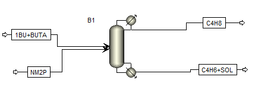

**Project Title:- ****Surrogate-based**** optimization of ****an extractive distillation process**** in an active learning manner.**

**Introduction:**

This Python code implements a surrogate-based optimization algorithm for
extractive distillation processes in an active learning manner. The
algorithm is designed to optimize the reboiler heat duty of the process by
selectingand determining the optimal operating conditions. The Python code uses
a combination of machine learning and optimization techniques to construct a
surrogate model that can accurately predict the heat duty of the process for
any given set of operating conditions. The active learning component of
the algorithm allows for the efficient exploration and exploitation of the
parameter space, reducing the number of simulations required to find the
optimal solution. This package is intended for use by researchers and
practitioners in the field of process optimization and can be easily integrated
into existing Python workflows.

**Problem statement:**

An extractive distillation column for the 1-butene/1,3-butadiene
separation is introduced. N-methyl-2-pyrrolidone (NMP) is
adopted as the solvent. The objective is to minimize reboiler heat duty
and to collect the key performance indicators (i.e., product purity
and reboiler heat duty) of the EDC at the convergence
point (i.e., varying numbers of stages, reflux ratios, and
flow rates of NMP).

